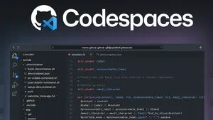
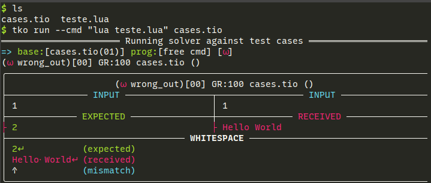
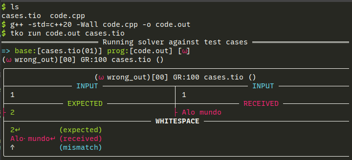

<!-- markdownlint-configure-file {
  "MD033": false,
  "MD041": false
} -->

<!-- toc -->
- [Instalação](#instalação)
- [Dependências](#dependências)
- [Download atividades](#download-atividades)
- [Rodando](#rodando)
  - [Rodando sem testar](#rodando-sem-testar)
  - [Rodando os testes](#rodando-os-testes)
  - [Rodando múltiplos arquivos](#rodando-múltiplos-arquivos)
- [Utilizando outras linguagens de programação](#utilizando-outras-linguagens-de-programação)
  - [Opção 1: chamando o interpretador da linguagem](#opção-1-chamando-o-interpretador-da-linguagem)
  - [Compilando antecipadamente](#compilando-antecipadamente)
- [Verificando o resultado](#verificando-o-resultado)
  - [Opções extras](#opções-extras)
- [O que é um teste?](#o-que-é-um-teste)
  - [Formatos de teste](#formatos-de-teste)
  - [Sintaxe TIO](#sintaxe-tio)
  - [Escrevendo alguns testes](#escrevendo-alguns-testes)
- [Convertendo entre formatos](#convertendo-entre-formatos)
<!-- toc -->

# tko

O TKO é um sistema de testes para programação competitiva. Ele é capaz de rodar testes em várias linguagens de programação e em vários formatos de testes. Ele está integrado com os repositórios de atividades das disciplinas de programação da UFC de Quixadá permitindo baixar as atividades e rodar os testes.

- [FUP - Fundamentos de Programação](https://github.com/qxcodefup/arcade)
- [ED - Estrutura de Dados](https://github.com/qxcodeed/arcade)
- [POO - Programação Orientada a Objetos](https://github.com/qxcodepoo/arcade)


## Instalação

| [Windows](install/windows.md) | [Linux](install/linux.md) | [Replit](replit/Readme.md) | [Codespace](install/codespace.md) |
| ------- | ----- | ------ | --------- |
| [](install/windows.md) | [](install/linux.md)       | [](replit/Readme.md) | [](install/codespace.md) |

```bash
# instalar utilizando o gerenciador de pacotes do python
pip install tko

# ou diretamente pelo github
pip install git+https://github.com/senapk/tko.git
```

## Dependências

Você precisará do compilador próprio da linguagem que for programar, instale manualmente no seu sistema. Se estiver no replit, o template da linguagem já vem com o compilador instalado.

- c/c++: `gcc` ou `g++`
- java: `javac`
- python: `python3`
- javascript: `node`
- typescript: `esbuild` e `node`

## Download atividades

- Para baixar, por exemplo, a atividade do carro do repositório de POO(Programação Orientada a Objetos): [contrua seu primeiro @carro](https://github.com/qxcodepoo/arcade/blob/master/base/carro/Readme.md) para `java`:

```bash
# Você informa o repositório `poo` o problema `carro` e vai ser perguntado a linguagem interativamente
# tko down _course _activity
tko down poo carro

# você pode também especificar a linguagem para pular o prompt
tko down poo carro -l java

# ou pode definir a linguagem padrão de download dos rascunhos para não precisar informar toda vez
tko config -l java
```

Ao baixar a questão, você terá uma pasta com o nome `carro` contendo:

- Readme.md: com a descrição da atividade em markdown.
- cases.tio: com os casos de teste.
- draft.ext: com o rascunho da solução.

## Rodando

### Rodando sem testar

Após baixar, entre na pasta.

Você pode aproveitar o arquivo de rascunho e renomeá-lo, ou criar seus próprios arquivos de resposta ao problema.

Para executar seu arquivo sem testar, basta rodar o comando `tko run` passando o arquivo de código como parâmetro.

Por exemplo, para a linguagem Java, você pode rodar o seguinte comando:

```bash
# tko run _arquivo_de_codigo
tko run Solver.java
```

A ferramenta vai compilar e executar seu código, mostrando se houve algum erro.

### Rodando os testes

Para rodar os testes, passe também o arquivo de testes `cases.tio` em qualquer ordem, antes ou depois do seu arquivo de código para o comando.

```bash
# tko run _arquivos_de_codigo _arquivo_de_casos_de_teste
tko run Solver.java cases.tio
```

### Descompactando os testes

Se preferir trabalhar com o modelo de testes em arquivos separados, você pode descompactar o arquivo `cases.tio` para uma pasta com os arquivos de entrada e saída. Será gerado um arquivo `.in` e um `.sol` para cada teste.

```bash
$ mkdir pasta
$ tko build pasta cases.tio
$ ls pasta
00.in 00.sol 01.in 01.sol 02.in 02.sol 03.in 03.sol 04.in 04.sol
```

Para rodar a partir da pasta com os testes descompactados, basta passar o nome da pasta como parâmetro.

```bash
tko run Solver.java pasta
```

Se quiser utilizar um nome padrão diferente para leitura ou escrita das pastas, veja a seção de [Convertendo entre formatos](#convertendo-entre-formatos).

### Rodando múltiplos arquivos

Se você tiver mais de um arquivo de código, o comportamento depende da linguagem.

<details>
<summary> Java </summary>

Se estiver executando `tko` de dentro da pasta. Basta executar o arquivo que contém a `main`. No exemplo abaixo, tanto a classe `Shell` quanto a classe `Motorcycle` contém a `main`. A classe `Shell` é usada para rodar junto com o `cases.tio`, para interpretar os testes. A classe `Motorcycle` é usada para rodar sem testes.

```bash
[lion@jungle java]$ ls
Adapter.java  cases.tio  Motorcycle.java  Person.java  Shell.java
[lion@jungle java]$ tko run Shell.java cases.tio 
═══════════════════════════ Running solver against test cases ═══════════════════════════
=> base:[cases.tio(15)] prog:[Shell.java] [✓ ✓ ✓ ✓ ✓ ✓ ✓ ✓ ✓ ✓ ✓ ✓ ✓ ✓ ✓]

[lion@jungle java]$ tko run Motorcycle.java 
─────────── No test cases found. Running: java -cp /tmp/tmph43lgfhb Motorcycle ──────────
Rodando a main do arquivo da motoca
[lion@jungle java]$ 
```

</details>

<details> <summary> C e C++ </summary>

- Você precisa passar todos os arquivo `c` ou `cpp` que deseja compilar e rodar.
- A ordem dos arquivos não importa, mas apenas um deles pode ter a função `main`.
- No exemplo abaixo, o arquivo `main.cpp` é o arquivo que contém a `main` e o arquivo `point.cpp` contém as implementação das funções que serão usadas no arquivo `main.cpp`.

```bash
[lion@jungle cpp]$ ls
cases.tio  fn.hpp  main.cpp  point.cpp  point.hpp
[lion@jungle cpp]$ tko run *.cpp cases.tio
═══════════════════════════ Running solver against test cases ═══════════════════════════
=> base:[cases.tio(02)] prog:[main.cpp, point.cpp] [✓ ✓]
```

</details>

<details> <summary> Typescript e Javascript </summary>

- Você precisa passar todos os arquivo `ts` ou `js` que deseja compilar e rodar. Exemplo
- O primeiro arquivo `.ts` passado por parâmetro é o arquivo que vai ser executado.
- Opção 1: Você pode escolher o arquivo principal, antes de passar os outros arquivos.
  - `tko run cases.tio shell.ts adapter.ts motoca.ts pessoa.ts`
- Opção 2: Você pode passar o arquivo principal primeiro e depois utilizar o `*.ts` para os outros.
  - `tko run cases.tio shell.ts *.ts`
- Opção 3: Você pode renomear o arquivo principal para um nome que esteja "antes" dos outros.
  - `mv shell.ts aashell.ts`
  - `tko run cases.tio *.ts`

</details>

<details> <summary> Exemplos: Typescript e Javascript </summary>

```bash
[lion@jungle ts]$ ls
adapter.ts  cases.tio  motoca.ts  pessoa.ts  shell.ts

##########################################
# PASSANDO OS ARQUIVOS SEM USAR WILDCARD *

[lion@jungle ts]$ tko run cases.tio shell.ts adapter.ts motoca.ts pessoa.ts 
═══════════════════════════ Running solver against test cases ═══════════════════════════
=> base:[cases.tio(15)] prog:[shell.ts, adapter.ts, motoca.ts, pessoa.ts] [✓ ✓ ✓ ✓ ✓ ✓ ✓ ✓ ✓ ✓ ✓ ✓ ✓ ✓ ✓]

##########################################
# PASSANDO O ARQUIVO PRINCIPAL PRIMEIRO E DEPOIS OS OUTROS

[lion@jungle ts]$ tko run cases.tio shell.ts *.ts
═══════════════════════════ Running solver against test cases ═══════════════════════════
=> base:[cases.tio(15)] prog:[shell.ts, adapter.ts, motoca.ts, pessoa.ts] [✓ ✓ ✓ ✓ ✓ ✓ ✓ ✓ ✓ ✓ ✓ ✓ ✓ ✓ ✓]

##########################################
# MUDANDO O NOME DO SHELL PARA AASHELL

[lion@jungle ts]$ mv shell.ts aashell.ts
[lion@jungle ts]$ tko run cases.tio *.ts
═══════════════════════════ Running solver against test cases ═══════════════════════════
=> base:[cases.tio(15)] prog:[aashell.ts, adapter.ts, motoca.ts, pessoa.ts] [✓ ✓ ✓ ✓ ✓ ✓ ✓ ✓ ✓ ✓ ✓ ✓ ✓ ✓ ✓]
```

Se algum módulo quiser ser executado individualmente, ele pode ter o seguinte bloco de código:

```ts
export { Motoca };
// esse if garante que o módulo só vai ser executado se for chamado diretamente
if (module === require.main) {
    let moto = new Motoca(2);
    console.log(moto.toString());
    moto.inserir(new Pessoa("jose", 9));
    console.log(moto.toString());
}

```

E pode ser executado passando o arquivo diretamente:

```bash
[lion@jungle ts]$ tko run motoca.ts pessoa.ts 

────────── No test cases found. Running: node /tmp/tmp2yhb8xem/motoca.js ──────────
power:2, time:0, person:(empty)
power:2, time:0, person:(jose:9)
```

</details>

## Utilizando outras linguagens de programação

### Opção 1: chamando o interpretador da linguagem

Códigos em `lua` podem ser executados por um interpretador, tal qual `python` e `javascript`.

Seja o seguinte código

```lua
// teste.lua
print("Hello World")
```

- Podemos mostrar ao `tko` qual comando executar com a flag `--cmd`:
  - `tko run --cmd "lua teste.lua" cases.tio`



### Compilando antecipadamente

Se sua linguagem gera código executável, tal qual `c`, `c++` ou `rust` você pode compilar e passar o executável para o `tko`. Vamos ver um exemplo em `c++`, compilado manualmente.

- compilação: `g++ -std=c++20 -Wall teste.cpp -o teste.out`
- teste: `tko run teste.out cases.tio`



## Verificando o resultado

Após fazer uma parte do código, executamos os testes novamente. Agora ele compila e mostra:

- Quantos testes passaram.
- O nome e o índice dos testes que falharam.
- O diff do primeiro teste que falhou
  - resultado esperado (lado esquerdo), resultado obtido (lado direito).
- O diff da primeira linha diferente renderizando os whitespaces.


### Opções extras

- É muito útil na hora de debugar, isolar o teste que você está trabalhando. Caso queira rodar apenas um índice de teste, utilize a opção `-i`:

```bash
# rodando apenas o teste 5 depois de encher o código de print para debugar
tko run Solver.java cases.tio -i 5
```

- Você pode mudar o modo padrão de ver o `diff` no `tko run` com:
  - Um em cima do outro (`-u` ou `--updown`)
  - Um ao lado do outro (`-s` ou `--sideby`)

```bash
tko run Solver.java cases.tio -u
```

- Através do `tko config`, você pode trocar configurações default para:
  - o padrão do `diff`.
  - esquema de cores: monocromático e colorido.
  - tipo de caracteres: entre ascii e unicode.
  - a linguagem padrão de download dos rascunhos.

```bash
$ tko config --help
options:
  -h, --help          show this help message and exit
  --show, -s          show current settings.
  --ascii             set ascii mode.
  --unicode           set unicode mode.
  --color             set colored mode.
  --mono              set mono mode.
  --side              set side_by_side diff mode.
  --updown            set up_to_down diff mode.
  --lang ext, -l ext  set default language extension.
  --ask               ask language extension every time.
```

Vou definir a cor para monocromático, `diff updown` e a linguagem padrão para `js`.

```bash
$ tko config --mono
Color mode now is: MONOCHROMATIC
$ tko config --updown
Diff mode now is: UP_DOWN
$ tko config -l js
Default language extension now is: js
```

## O que é um teste?

- Um teste define qual o comportamento esperado de um programa determinístico. Para uma determinada entrada, o programa deve gerar **sempre** a mesma saída.
- A entrada e saída e o comportamento esperado devem ser bem definidos, por exemplo:
  - Dados dois números inteiros de entrada, um por linha, mostre o resultado da divisão. Se o resultado for inteiro, mostre o valor inteiro, se for flutuante, mostre com duas casas decimais.

### Formatos de teste

- Um arquivo de texto com vários testes:
  - modelo TIO(test input output).
  - modelo VPL que é utilizado no plugin do moodle.
- Uma pasta com um dois arquivos para cada teste, um arquivo com a entrada e outro com a saída.
  - modelo maratona:
    - Arquivos .in e .out
    - Arquivos .in e .sol

---

### Sintaxe TIO

```txt
>>>>>>>>
entrada
...
========
saída
...
<<<<<<<<

>>>>>>>>
entrada
...
========
saída
...
<<<<<<<<
```

---

### Escrevendo alguns testes

Vamos escrever alguns testes para o problema proposto. Crie um arquivo chamado `testes.tio` e vamos inserir algumas entradas para o problema proposto.

```txt
>>>>>>>>
4
2
========
2
<<<<<<<<

>>>>>>>>
3
2
========
1.50
<<<<<<<<

>>>>>>>>
5
4
========
1.25
<<<<<<<<

>>>>>>>>
1
3
========
0.33
<<<<<<<<
```

## Convertendo entre formatos

- Gerando um `t.vpl`
  - `tko build t.vpl testes.tio`
- Gerando um `t.tio` a partir do `Readme.md`e de um `extra.tio`.
  - `tko build t.tio Readme.md extra.tio`
- Para extrair os testes para uma pasta com um arquivo para entrada e outro para saída, crie uma pasta vazia e passe para o primeiro parâmetro do `tko build`.

```bash
$ ls
cases.tio  draft.c  Readme.md
$ mkdir pasta
$ tko build pasta cases.tio 
$ ls pasta/
00.in   02.sol  05.in   07.sol  10.in   12.sol  15.in   17.sol  20.in   22.sol
00.sol  03.in   05.sol  08.in   10.sol  13.in   15.sol  18.in   20.sol  23.in
01.in   03.sol  06.in   08.sol  11.in   13.sol  16.in   18.sol  21.in   23.sol
01.sol  04.in   06.sol  09.in   11.sol  14.in   16.sol  19.in   21.sol
02.in   04.sol  07.in   09.sol  12.in   14.sol  17.in   19.sol  22.in
```

- Você pode definir o padrão de nome dos arquivos gerados com `-p "@ @"`, sendo @ o wildcard que representa a numeração dos arquivo.
  - Vamos refazer o comando acima, mas colocando "-p in.@ out.@"

```bash
$ tko build pasta/ cases.tio -p "in.@ out.@"
$ ls pasta/
in.00  in.05  in.10  in.15  in.20   out.01  out.06  out.11  out.16  out.21
in.01  in.06  in.11  in.16  in.21   out.02  out.07  out.12  out.17  out.22
in.02  in.07  in.12  in.17  in.22   out.03  out.08  out.13  out.18  out.23
in.03  in.08  in.13  in.18  in.23   out.04  out.09  out.14  out.19
in.04  in.09  in.14  in.19  out.00  out.05  out.10  out.15  out.20
```

- O `pattern` é útil para converter os formatos de Maratona, que vem em múltiplos arquivos para o `.tio`. Basta fazer o `match` do modelo que eles utilizarem.
  - `-p "@.in @.out"`
  - `-p "in@ out@"`
  - entre outros.
