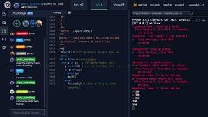

<!-- markdownlint-configure-file {
  "MD033": false,
  "MD041": false
} -->

# tko

O TKO é um sistema de testes para programação competitiva. Ele é capaz de rodar testes em várias linguagens de programação e em vários formatos de testes. Ele está integrado com os repositórios de atividades das disciplinas de programação da UFC de Quixadá permitindo baixar as atividades e rodar os testes.

- [FUP - Fundamentos de Programação](https://github.com/qxcodefup/arcade)
- [ED - Estrutura de Dados](https://github.com/qxcodeed/arcade)
- [POO - Programação Orientada a Objetos](https://github.com/qxcodepoo/arcade)


## Instalação

| [Windows](install/windows.md) | [Linux](install/linux.md) | [Replit](replit/Readme.md) | [Codespace](install/codespace.md) |
| ------- | ----- | ------ | --------- |
| [](install/windows.md) | [](install/linux.md)       | [](replit/Readme.md) | [](install/codespace.md) |

```bash
# instalar utilizando o gerenciador de pacotes do python
pip install tko
```

## Dependências

Você precisará do compilador próprio da linguagem que for programar, instale manualmente no seu sistema. Se estiver no replit, o template da linguagem já vem com o compilador instalado.

- c/c++: `gcc` ou `g++`
- java: `javac`
- python: `python3`
- javascript: `node`
- typescript: `esbuild` e `node`

## Download atividades

- Para baixar, por exemplo, a atividade do carro do repositório de POO(Programação Orientada a Objetos): [contrua seu primeiro @carro](https://github.com/qxcodepoo/arcade/blob/master/base/carro/Readme.md) para `java`:

```bash
# Você informa o repositório `poo` o problema `carro` e vai ser perguntado a linguagem interativamente
# tko down _course _activity
tko down poo carro

# você pode também especificar a linguagem para pular o prompt
tko down poo carro -l java

# ou pode definir a linguagem padrão de download dos rascunhos para não precisar informar toda vez
tko config -l java
```

Ao baixar a questão, você terá uma pasta com o nome `carro` contendo:

- Readme.md: com a descrição da atividade.
- cases.tio: com os casos de teste.
- draft.ext: com o rascunho da solução.

## Rodando

### Rodando sem testar

Após baixar, entre na pasta.

Você pode aproveitar o arquivo de rascunho e renomeá-lo, ou criar seus próprios arquivos de resposta ao problema.

Para executar seu arquivo sem testar, basta rodar o comando `tko run` passando o arquivo de código como parâmetro.

Por exemplo, para a linguagem Java, você pode rodar o seguinte comando:

```bash
# tko run _arquivo_de_codigo
tko run Solver.java
```

A ferramenta vai compilar e executar seu código, mostrando se houve algum erro.

### Rodando os testes

Para rodar os testes, passe também o arquivo de testes `cases.tio` em qualquer ordem, antes ou depois do seu arquivo de código para o comando.

```bash
# tko run _arquivos_de_codigo _arquivo_de_casos_de_teste
tko run Solver.java cases.tio
```


### Rodando múltiplos arquivos

Se você tiver mais de um arquivo de código, o comportamento depende da linguagem.

<details>
<summary> Java </summary>

Se estiver executando `tko` de dentro da pasta. Basta executar o arquivo que contém a `main`. No exemplo abaixo, tanto a classe `Shell` quanto a classe `Motorcycle` contém a `main`. A classe `Shell` é usada para rodar junto com o `cases.tio`, para interpretar os testes. A classe `Motorcycle` é usada para rodar sem testes.

```bash
[lion@jungle java]$ ls
Adapter.java  cases.tio  Motorcycle.java  Person.java  Shell.java
[lion@jungle java]$ tko run Shell.java cases.tio 
═══════════════════════════ Running solver against test cases ═══════════════════════════
=> base:[cases.tio(15)] prog:[Shell.java] [✓ ✓ ✓ ✓ ✓ ✓ ✓ ✓ ✓ ✓ ✓ ✓ ✓ ✓ ✓]

[lion@jungle java]$ tko run Motorcycle.java 
─────────── No test cases found. Running: java -cp /tmp/tmph43lgfhb Motorcycle ──────────
Rodando a main do arquivo da motoca
[lion@jungle java]$ 
```

</details>

<details> <summary> C e C++ </summary>

- Você precisa passar todos os arquivo `c` ou `cpp` que deseja compilar e rodar.
- A ordem dos arquivos não importa, mas apenas um deles pode ter a função `main`.
- No exemplo abaixo, o arquivo `main.cpp` é o arquivo que contém a `main` e o arquivo `point.cpp` contém as implementação das funções que serão usadas no arquivo `main.cpp`.

```bash
[lion@jungle cpp]$ ls
cases.tio  fn.hpp  main.cpp  point.cpp  point.hpp
[lion@jungle cpp]$ tko run *.cpp cases.tio
═══════════════════════════ Running solver against test cases ═══════════════════════════
=> base:[cases.tio(02)] prog:[main.cpp, point.cpp] [✓ ✓]
```

</details>

<details> <summary> Typescript e Javascript </summary>

- Você precisa passar todos os arquivo `ts` ou `js` que deseja compilar e rodar. Exemplo
- O primeiro arquivo `.ts` passado por parâmetro é o arquivo que vai ser executado.
- Opção 1: Você pode escolher o arquivo principal, antes de passar os outros arquivos.
  - `tko run cases.tio shell.ts adapter.ts motoca.ts pessoa.ts`
- Opção 2: Você pode passar o arquivo principal primeiro e depois utilizar o `*.ts` para os outros.
  - `tko run cases.tio shell.ts *.ts`
- Opção 3: Você pode renomear o arquivo principal para um nome que esteja "antes" dos outros.
  - `mv shell.ts aashell.ts`
  - `tko run cases.tio *.ts`

</details>

<details> <summary> Exemplos: Typescript e Javascript </summary>

```bash
[lion@jungle ts]$ ls
adapter.ts  cases.tio  motoca.ts  pessoa.ts  shell.ts

##########################################
# PASSANDO OS ARQUIVOS SEM USAR WILDCARD *

[lion@jungle ts]$ tko run cases.tio shell.ts adapter.ts motoca.ts pessoa.ts 
═══════════════════════════ Running solver against test cases ═══════════════════════════
=> base:[cases.tio(15)] prog:[shell.ts, adapter.ts, motoca.ts, pessoa.ts] [✓ ✓ ✓ ✓ ✓ ✓ ✓ ✓ ✓ ✓ ✓ ✓ ✓ ✓ ✓]

##########################################
# PASSANDO O ARQUIVO PRINCIPAL PRIMEIRO E DEPOIS OS OUTROS

[lion@jungle ts]$ tko run cases.tio shell.ts *.ts
═══════════════════════════ Running solver against test cases ═══════════════════════════
=> base:[cases.tio(15)] prog:[shell.ts, adapter.ts, motoca.ts, pessoa.ts] [✓ ✓ ✓ ✓ ✓ ✓ ✓ ✓ ✓ ✓ ✓ ✓ ✓ ✓ ✓]

##########################################
# MUDANDO O NOME DO SHELL PARA AASHELL

[lion@jungle ts]$ mv shell.ts aashell.ts
[lion@jungle ts]$ tko run cases.tio *.ts
═══════════════════════════ Running solver against test cases ═══════════════════════════
=> base:[cases.tio(15)] prog:[aashell.ts, adapter.ts, motoca.ts, pessoa.ts] [✓ ✓ ✓ ✓ ✓ ✓ ✓ ✓ ✓ ✓ ✓ ✓ ✓ ✓ ✓]
```

Se algum módulo quiser ser executado individualmente, ele pode ter o seguinte bloco de código:

```ts
export { Motoca };
// esse if garante que o módulo só vai ser executado se for chamado diretamente
if (module === require.main) {
    let moto = new Motoca(2);
    console.log(moto.toString());
    moto.inserir(new Pessoa("jose", 9));
    console.log(moto.toString());
}

```

E pode ser executado passando o arquivo diretamente:

```bash
[lion@jungle ts]$ tko run motoca.ts pessoa.ts 

────────── No test cases found. Running: node /tmp/tmp2yhb8xem/motoca.js ──────────
power:2, time:0, person:(empty)
power:2, time:0, person:(jose:9)
```

</details>

### Verificando o resultado

Após fazer uma parte do código, executamos os testes novamente. Agora ele compila e mostra:

- Quantos testes passaram.
- O nome e o índice dos testes que falharam.
- O diff do primeiro teste que falhou
  - resultado esperado (lado esquerdo), resultado obtido (lado direito).
- O diff da primeira linha diferente renderizando os whitespaces.


### Opções extras

- Caso queira rodar apenas um índice de teste, utilize a opção `-i`:

```bash
tko run Solver.java cases.tio -i 1
```

- Caso queira o diff `up down` ao invés de `left right`, utilize a opção `-v`:

```bash
tko run Solver.java cases.tio -v
```

## O que é um teste?

- Um teste define qual o comportamento esperado de um programa determinístico. Para uma determinada entrada, o programa deve gerar **sempre** a mesma saída.
- A entrada e saída e o comportamento esperado devem ser bem definidos, por exemplo:
  - Dados dois números inteiros de entrada, um por linha, mostre o resultado da divisão. Se o resultado for inteiro, mostre o valor inteiro, se for flutuante, mostre com duas casas decimais.

## Formatos de teste

- Um arquivo de texto com vários testes:
  - modelo TIO(test input output).
  - modelo VPL que é utilizado no plugin do moodle.
- Uma pasta com um dois arquivos para cada teste, um arquivo com a entrada e outro com a saída.
  - modelo maratona:
    - Arquivos .in e .out
    - Arquivos .in e .sol

---

### Sintaxe TIO

```txt
>>>>>>>>
entrada
...
========
saída
...
<<<<<<<<

>>>>>>>>
entrada
...
========
saída
...
<<<<<<<<
```

---

### Escrevendo alguns testes

Vamos escrever alguns testes para o problema proposto. Crie um arquivo chamado `testes.tio` e vamos inserir algumas entradas para o problema proposto.

```txt
>>>>>>>>
4
2
========
2
<<<<<<<<

>>>>>>>>
3
2
========
1.50
<<<<<<<<

>>>>>>>>
5
4
========
1.25
<<<<<<<<

>>>>>>>>
1
3
========
0.33
<<<<<<<<
```

---

## Testando um código com erros

- Crie algum código que tenta resolver o problema.

```python
# solver.py
a = int(input())
b = int(input())
print(a/b)
```

```c
// solver.c
#include <stdio.h>
int main(){
    int a = 0, b = 0;
    scanf("%d %d", &a, &b);
    printf("%d\n", (a/b));
}
```

- Rodando diretamente passando o código fonte
  - `tko run solver.c testes.tio`: compila e testa seu código.
  - `tko run solver.py testes.tio`: chama o interpretador e testa o código.
  - `tko run "python2 solver.py" testes.tio`.
- Se pode compilar manualmente e passar o executável em qualquer linguagem. Se passar o código fonte, o script vai compilar com muitos critérios restritivos para garantir que seu código esteja bem feito.

## Executando

- Opções extras:
  - As mesmas do list:
    - `-i ou --index`: roda um índice específico
    - `-a ou --all`: mostra todos os testes que falharam e não apenas o primeiro.

- Vamos consertar nosso código

```c
// solver.c
#include <stdio.h>
int main(){
    int a = 0, b = 0;
    scanf("%d %d", &a, &b);
    if(a % b == 0)
        printf("%d\n", (a/b));
    else
        printf("%.2f\n", (float)a/b);
}
```

- Rode agora e ele deve mostrar que todos os testes foram sucesso.

---

## Convertendo entre formatos

- Gerando um `t.vpl`
  - `tko build t.vpl testes.tio`
- Gerando um `t.tio` a partir do `Readme.md`e de um `extra.tio`.
  - `tko build t.tio Readme.md extra.tio`

## Exemplos rápidos

```bash
# mostra os testes
tko list t.tio

# roda o executável solver.c e usa o arquivo t.tio como pacote de testes
tko run solver.c t.tio

# se seus testes estiverem em arquivos com a extensão .tio ou .vpl ou .md
# para listar basta digitar
tko list cases.tio

# roda apenas o teste número 3
tko run solver.py t.tio -i 3

# ou então rodar usando
tko run solver.cpp "testes @.in @.sol"

```
