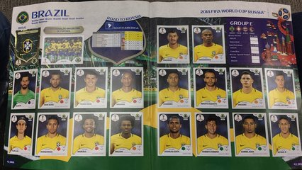

# Figurinhas repetidas

## Contexto

Baruel Ruel tem muitas figurinhas do álbum de futebol. Ele estava indo para uma feira de troca de figurinhas quando tropeçou e misturou as figurinhas todas. Ele não sabe mais quais figurinhas estão repetidas e tem pra trocar, nem quais estão faltando pra completar a coleção. Ajude Baruel Ruel com essa tarefa.

### Entrada

- **linha 1:** Um inteiro representando a quantidade total de figurinhas do álbum (1 a 50).
- **linha 2:** Um inteiro representando a quantidade de figurinhas que Baruel possui (1 a 100).
- **linha 3:** Uma sequência de inteiros representando os números das figurinhas que Baruel possui, em **ORDEM CRESCENTE**.

### Saída

- **Linha 1:** Os números das figurinhas que estão repetidas ou **"N"** se não houver nenhuma.
- **Linha 2:** Os números das figurinhas que estão faltando no álbum ou **"N"** se nenhuma estiver faltando.

## Testes

<!-- load tests.toml --tests 2 -->
<table><tr><th><code>      Entrada      </code>
</th><th><code>   Saída   </code>
</th></tr><tr><td valign="top"><pre>
5
8
1 1 1 1 2 2 3 5
</pre></td><td valign="top"><pre>
1 1 1 2
4
</pre></td></tr></table>

<table><tr><th><code>      Entrada      </code>
</th><th><code>   Saída   </code>
</th></tr><tr><td valign="top"><pre>
2
4
1 1 2 2
</pre></td><td valign="top"><pre>
1 2
N
</pre></td></tr></table>

<!-- load -->
