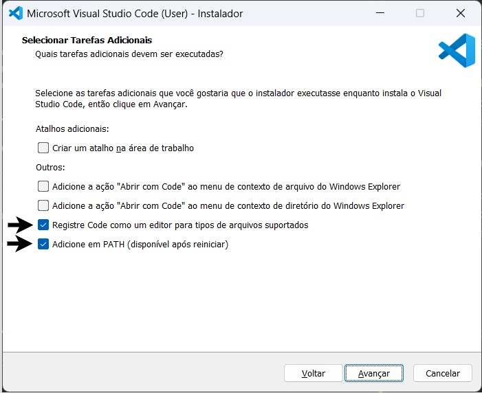

# Window sem WSL

## VSCODE

O Visual Studio Code (VS Code) é um editor de código fonte utilizado por programadores para escrever, editar depurar e organizar projetos de software em diversas linguagens.  

1. Acesse: [Visual Studio Code Download](https://code.visualstudio.com/sha/download?build=stable&os=win32-x64-user)
2. Execute o instalador
3. Siga as instruções do instalador

**Atenção!:** certifique-se de que as duas últimas opções estão marcadas, elas te pouparão muito trabalho no futuro.



4. Reinicie o seu computador

Agora você já possui o VS Code de forma funcional em seu computador.

## Git Bash

O Git é um sistema de controle de versão, usado principalmente para gerenciar o código-fonte de projetos de software, permitindo que você acompanhe todas as mudanças feitas em arquivos ao longo do tempo, facilitando a colaboração com outras pessoas e a reversão de erros.

1. Acesse: [https://git-scm.com/download/win](https://git-scm.com/download/win)
2. Execute o instalador e siga as opções padrão (pode aceitar tudo como vem).

Ponto! A instalação do git foi concluida e agora você possui o terminal bash.

Essa etapa de configuração serve para identificar suas ações no repositório (commits, etc.).

**No terminal (Git bash):**

```bash
git config --global user.name "Seu Nome"
git config --global user.email "seuemail@example.com"
```

---

A chave SSH (Secure Shell) serve como uma forma segura de autenticação entre seu computador e o GitHub, sem que você precise digitar seu usuário e senha toda vez que fizer alguma interação utilizando o git ou clonar para sua máquina algum repositório de acesso restrito.  

Aqui estaremos gerando uma chave SSH e adicionando a sua conta do Github.

**No terminal (Git Bash):**

```bash
ssh-keygen -t ed25519 -C "seuemail@example.com"
```

- Você pode gerar uma **senha** para sua chave SSH. Caso não queira configurar uma senha, pode simplesmente apertar **enter** para continuar sem senha.

**Depois:**

```bash
cat ~/.ssh/id_ed25519.pub
```

- Copie a chave gerada em seu terminal bash.

- Entre nas configurações de chave SSH e GPG com sua conta do Github: [https://github.com/settings/keys](https://github.com/settings/keys).

- Aperte em **New SSH key** na direita.

- Adicione um título para sua chave e coloque a chave gerada no terminal bash no espaço livre abaixo.

- Aperte em **Add SSH key**.

E pronto, você já conseguiu gerar e adicionar sua chave SSH a sua conta do Github, autenticando sua máquina!

## Python, Pipx, TKO

Se tiver qualquer versão instalada do Python, desinstale-a para não dar conflito. A opção melhor é instalar o Python pelo instalador do windows. Abra o PowerShell e digite:

```bash
python
```

Ele não irá encontrar e vai direcionar você para a Microsoft Store. Clique no botão para instalar o Python. Depois de instalado, abra o PowerShell e digite:

```bash
python --version

# Instale o pipx
python -m pip install --upgrade pip
python -m pip install --user pipx
python -m pipx ensurepath

# Instale o TKO
pipx install tko
```