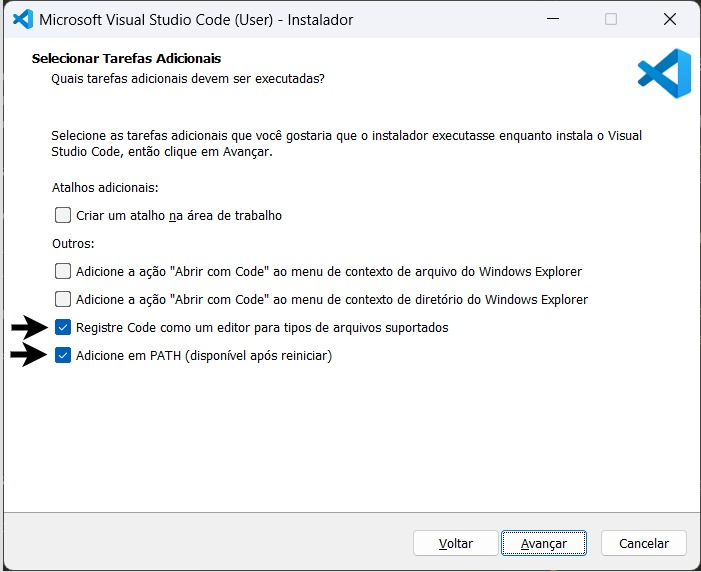

# Windows com WSL e Ubuntu

Este é o caminho recomendado para alunos usando Windows.

O objetivo não é depender de Python, Git ou compiladores instalados diretamente no Windows. O fluxo recomendado é usar o Windows para rodar o VS Code e o WSL para rodar Ubuntu, terminal, Git, Python, linguagens e TKO.

## Meta do ambiente

Ao final, a máquina deve ter:

- VS Code instalado no Windows.
- Extensão WSL instalada no VS Code.
- WSL 2 funcionando.
- Ubuntu instalado dentro do WSL.
- Terminal Ubuntu abrindo normalmente.
- Integração `code .` funcionando a partir do Ubuntu.
- Ferramentas básicas de desenvolvimento instaladas no Ubuntu.

Depois disso, siga o guia [Ubuntu / WSL: Git, Python, pipx e TKO](ubuntu_git_python_tko.md).

Se algum passo falhar por versão do Windows, política da máquina, permissão ou diferença de instalação, procure a documentação atual da ferramenta específica (WSL, Ubuntu, VS Code ou GitHub) e volte para a lista de verificação deste guia.

## Instalar VS Code no Windows

1. Acesse [Visual Studio Code Download](https://code.visualstudio.com/sha/download?build=stable&os=win32-x64-user).
2. Execute o instalador.
3. Siga as instruções do instalador.

Durante a instalação, marque as opções que adicionam o VS Code ao menu de contexto e ao PATH. Elas facilitam abrir projetos pelo terminal.



Depois, abra o PowerShell e instale a extensão do WSL:

```powershell
code --install-extension ms-vscode-remote.remote-wsl
```

## Instalar WSL com Ubuntu

Abra o PowerShell como Administrador e execute:

```powershell
wsl --install
```

Esse comando normalmente instala o WSL 2 com Ubuntu como distribuição padrão.

Depois da instalação:

1. Reinicie o computador, se o Windows solicitar.
2. Abra o aplicativo Ubuntu pelo menu Iniciar.
3. Crie um usuário e uma senha Linux quando o Ubuntu pedir.

A senha Linux não precisa ser igual à senha do Windows. Ao digitar a senha no terminal, é normal nada aparecer na tela.

## Preparar o Ubuntu

No terminal Ubuntu, atualize os pacotes:

```bash
sudo apt update
sudo apt upgrade -y
```

Instale ferramentas básicas:

```bash
sudo apt install -y build-essential git curl ca-certificates wslu
```

Configure o navegador padrão para comandos que abrem links a partir do WSL:

```bash
grep -qxF 'export BROWSER="wslview"' ~/.bashrc || echo 'export BROWSER="wslview"' >> ~/.bashrc
```

Feche e abra novamente o terminal Ubuntu.

## Testar integração com VS Code

No Ubuntu, crie uma pasta temporária e abra no VS Code:

```bash
mkdir -p ~/teste-wsl
cd ~/teste-wsl
code .
```

O VS Code deve abrir conectado ao WSL. Na barra inferior do VS Code, deve aparecer algo como `WSL: Ubuntu`.

## Próximo passo

Com WSL, Ubuntu e VS Code funcionando, continue em:

- [Ubuntu / WSL: Git, Python, pipx e TKO](ubuntu_git_python_tko.md)
- [Linguagens de programação](Linguagens.md), conforme a disciplina

## Checklist de verificação

No terminal Ubuntu, verifique:

```bash
wsl.exe --status
git --version
code --version
```

Se `code .` não funcionar dentro do Ubuntu, reinstale ou atualize a extensão WSL do VS Code e confira a documentação atual do VS Code para WSL.
